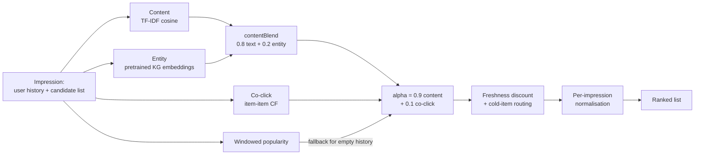

# Interpretable Hybrid News Recommender on MIND

> Team project for UNSW COMP9727 Recommender Systems (Term 2, 2026), shown here for portfolio purposes. Source code is kept private under university academic-integrity rules; **source available on request**.

A training-free news re-ranker for the Microsoft News Dataset (MIND-small) that combines content similarity, knowledge-graph entities, co-click evidence and an explicit freshness policy, evaluated under the official MIND protocol with strict leakage control. Built for the case where most users and most articles are new.

## Results

- Final system **nDCG@10 0.3789 (AUC 0.6137, MRR 0.2952)** on 73,152 official dev impressions, against a random floor of 0.2862 and a 24-hour popularity baseline of 0.3155. The measured random baseline matches the closed-form expectation to four decimal places, an end-to-end check on the metric pipeline.
- **Cold-start gain**: freshness discount plus cold-item routing lifts cold-click nDCG@10 from 0.4343 to **0.4666**, the best cold-start result of every system evaluated, at a cost of −0.008 on warm clicks.
- **Leakage audit**: five dimensions checked (temporal split, label leakage into features, metric implementation, channel construction, protocol), zero inflating issues; an independent from-scratch re-implementation reproduced all baselines within 0.001. A small NRMS neural ranker trained as a control reached 0.3513.

## My role

Team direction and the shared foundation: data pipeline, the unified evaluation framework (official MIND metric semantics, time-based split, leakage controls), the progressive hybrid design adopted as the team's main line, and the post-presentation metrics audit.

## Architecture

## Tech stack

Python · pandas · NumPy · scikit-learn (TF-IDF) · PyTorch (NRMS control) · Jupyter

## Data

MIND-small (Microsoft News Dataset), released under the Microsoft Research License Terms; not redistributed here. Download from msnews.github.io.

## Contributors

Bingcheng Liu · Wenqi Hao · Anthony Huang · Zijie Cai · Zeyu Ma
